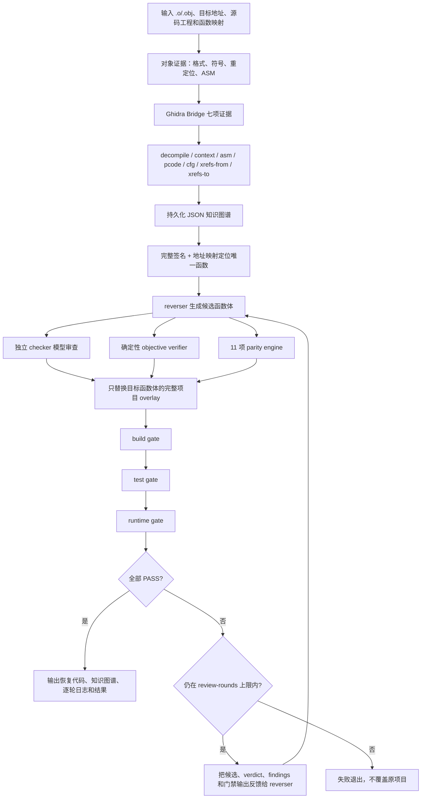

# mini-re

[](https://github.com/gaohuan2020/mini-re/actions/workflows/ci.yml)
[](https://www.python.org/)
[](LICENSE)

`mini-re` 0.5.0 是参考 [Dryxio/auto-re-agent](https://github.com/Dryxio/auto-re-agent) 编写的单函数反编译与验证工具。除 `--dump-evidence` 这种只读诊断外，每次 CLI 执行都强制经过同一条完整流水线，不能降级为“只问一次 LLM 然后编译”。

它的目标不是自动重写整个反编译项目，而是把一个对象文件中的目标函数映射回真实源码工程，在隔离 overlay 内只替换该函数体，并用确定性检查、独立模型审查和真实项目门禁形成有界修复闭环。

固定流水线包括：

1. 从 `.o`/`.obj` 提取 `file`、符号、重定位和反汇编证据。
2. 严格调用 Ghidra Bridge 的 `decompile`、`context`、`asm`、`pcode`、`cfg`、`xrefs-from`、`xrefs-to`；任何一项失败或返回空内容都会终止。
3. 将对象符号、函数、调用关系、字符串、全局变量及 Ghidra artifact 持久化到 JSON 知识图谱。
4. 通过地址映射和完整源签名定位唯一函数；重载仍有歧义就拒绝修改。
5. reverser 模型根据二进制、Ghidra、知识图谱和项目源码生成候选，独立 checker 返回严格 JSON verdict。
6. 每轮运行确定性 objective verifier，对比 decompile、ASM、P-code 和 CFG 的调用、控制流、循环、switch、return 和块结构。
7. 每轮运行固定 11 项 parity engine，生成 `GREEN/YELLOW/RED`；RED 默认阻塞。
8. 每轮复制完整项目到隔离 overlay，只替换目标函数体，依次执行独立 build、test、runtime 门禁。
9. 任一检查失败，就把上一候选、checker、objective、parity 及全部门禁诊断反馈给下一轮 reverser。
10. 只有 checker PASS、objective PASS、parity policy 允许且全部配置门禁通过才成功。

`PASS` 是保守的工程验证结果，不是语义等价或二进制一致性的形式化证明。

## 整体流程



| 阶段 | 必需输入 | 主要产物 | 阻塞条件 |
|---|---|---|---|
| 对象分析 | `.o`/`.obj` | 格式、符号、重定位、反汇编 | 非对象文件、工具失败 |
| Ghidra | 地址和 bridge | 7 项只读 artifact | 任一项失败或为空 |
| 图谱与定位 | artifact、项目源码、地址映射 | JSON 知识图谱、唯一目标函数 | 签名/地址冲突或重载歧义 |
| reverser/checker | 两个不同模型 | 候选函数、JSON verdict | 模型协议错误、checker FAIL |
| 确定性检查 | 候选、ASM、P-code、CFG | objective verdict、11 项 parity | objective FAIL 或 parity RED |
| 项目 overlay | 完整项目副本、候选函数体 | 隔离构建目录 | 替换范围不唯一 |
| 三重门禁 | 用户声明的真实命令 | build/test/runtime 结果 | 任一配置门禁失败 |
| 有界修复 | 上轮全部诊断 | 下一轮完整 prompt 和新候选 | 达到轮数上限仍未通过 |

这里的 loop 是明确可审计的反馈闭环：checker、objective、parity、build、test、runtime 中任何失败都会进入下一轮 prompt；每轮 prompt、模型原始响应、verdict 和命令结果都会写入 `reports/mini-re/logs/round-*.json`。

## 快速体验

不需要真实模型即可运行完整的两轮修复演示。演示会真实编译复杂 C 对象，使用严格 fake Ghidra 和两个 scripted 模型，验证第一轮失败诊断确实进入第二轮 prompt：

```bash
git clone https://github.com/gaohuan2020/mini-re.git
cd mini-re
python3 -m pip install -e .
python3 examples/complex_loop_demo.py --output-dir work/complex-loop-demo
```

### 多文件 C++ 项目测试

`examples/complex_project/` 是一个可独立构建的 C++17 项目，而不是单文件测试夹具。它包含：

- 静态库、CLI、单元测试和跨文件 helper；
- `Analyzer::score` 的标量/向量重载；
- 完整签名和地址映射消歧；
- 循环、clamp 分支、四路 switch、跨文件调用和状态累计；
- CMake 与 Make 两套真实构建入口；
- build、test、runtime 三类独立门禁。

执行完整两轮修复：

```bash
python3 examples/complex_project_demo.py \
  --output-dir work/complex-project-demo
```

预期过程如下：

| 轮次 | checker | objective | build | test | runtime | 结果 |
|---|---|---|---|---|---|---|
| 1 | FAIL | FAIL | PASS | PASS | FAIL | 将缺失循环/switch 和 CLI 行为错误反馈给 reverser |
| 2 | PASS | PASS | PASS | PASS | PASS | 保存恢复函数、知识图谱、overlay 和逐轮日志 |

第一轮候选仍能编译成静态库，并能通过只覆盖 helper 与标量重载的单元测试，但 CLI 的向量行为检查失败。这可以验证三类门禁彼此独立。第二轮只替换 [`src/analyzer.cpp`](examples/complex_project/src/analyzer.cpp) 中向量重载的函数体，标量重载和其他文件保持不变。

复杂项目也可以不经过 mini-re 单独构建；checked-in 源码故意包含待恢复 stub，因此 `make runtime` 预期失败：

```bash
cd examples/complex_project
make clean all
make test
make runtime  # 原始 stub 项目预期失败
```

CMake 用户可以运行：

```bash
cmake -S examples/complex_project -B work/complex-project-cmake
cmake --build work/complex-project-cmake
ctest --test-dir work/complex-project-cmake --output-on-failure
```

## `.o` 与对应反编译代码

仓库直接包含一个可下载、可分析的 x86-64 ELF 对象，以及它的对照源码和反编译风格恢复结果：

| 文件 | 用途 |
|---|---|
| [`examples/decompile_demo/score_bytes.o`](examples/decompile_demo/score_bytes.o) | 使用 clang `-O2` 生成的 ELF relocatable object |
| [`examples/decompile_demo/score_bytes_source.c`](examples/decompile_demo/score_bytes_source.c) | 仅用于验证和理解对象来源的原始实现 |
| [`examples/decompile_demo/score_bytes.decompiled.c`](examples/decompile_demo/score_bytes.decompiled.c) | 与对象控制流对应的反编译风格 C 代码 |

对象中包含早退、循环、数据相关分支和四路 `switch`。可以先确认格式与符号，再让 mini-re 输出本地证据：

```bash
file examples/decompile_demo/score_bytes.o
# ELF 64-bit LSB relocatable, x86-64, ...

nm -g examples/decompile_demo/score_bytes.o
# 0000000000000000 T score_bytes

python3 mini_re.py examples/decompile_demo/score_bytes.o --dump-evidence
```

对应恢复函数保留了对象中的循环、四种算术路径、状态转移计数和返回值掩码；变量名和类型是反编译器常见的通用形式：

```c
int score_bytes(byte *param_1, ulong param_2, int param_3) {
    byte previous;
    uint accumulator;
    ulong index;
    int transitions;

    if ((param_1 == (byte *)0) || (param_2 == 0))
        return -1;

    previous = *param_1;
    accumulator = (uint)param_3 ^ 0x9e3779b9u;
    index = 0;
    transitions = 0;

    do {
        byte value = param_1[index];
        transitions += value != previous;
        switch (index & 3) {
            case 0: accumulator += (uint)value * 3u; break;
            case 1: accumulator ^= (uint)value << 5; break;
            case 2: accumulator = (accumulator << 7 | accumulator >> 25) + value; break;
            default: accumulator -= (uint)value * 7u; break;
        }
        previous = value;
        ++index;
    } while (index < param_2);

    return (int)((accumulator ^ (uint)transitions) & 0x7fffffffu);
}
```

上面的片段为了突出主体控制流省略了类型定义；可编译的完整恢复文件会由测试重新编译，并与原始实现对多组长度、字节序列和 seed 做运行结果对比。

可用下面的命令重新生成随仓库提交的 ELF 对象：

```bash
clang --target=x86_64-unknown-linux-gnu -std=c11 -O2 \
  -fno-ident -fno-asynchronous-unwind-tables \
  -c examples/decompile_demo/score_bytes_source.c \
  -o examples/decompile_demo/score_bytes.o
```

注意：优化后的对象通常已经丢失原变量名和部分源级类型信息，因此反编译结果是可验证的高层重建，不是原源码的逐字恢复，也不是形式化等价证明。

## 要求

- Python 3.9+
- `file`、`nm`、`objdump`；macOS 可自动回退到 `otool`
- 项目使用的 `cc`/`c++`、CMake 或其他构建工具
- 已配置并导出目标程序的 [`ghidra-ai-bridge`](https://github.com/Dryxio/ghidra-ai-bridge)
- 两个显式且独立的模型配置

先确认全部 Ghidra 证据命令可用：

```bash
ghidra-bridge decompile 0x401000
ghidra-bridge context 0x401000
ghidra-bridge asm 0x401000
ghidra-bridge pcode 0x401000
ghidra-bridge cfg 0x401000
ghidra-bridge xrefs-from 0x401000
ghidra-bridge xrefs-to 0x401000
```

## 完整运行

```bash
python3 mini_re.py build/target.o \
  --provider codex \
  --model reverser-model \
  --checker-provider openai \
  --checker-model checker-model \
  --ghidra-cli ghidra-bridge \
  --address 0x401000 \
  --project-root . \
  --source-file src/Target.cpp \
  --function 'Target::Run' \
  --function-signature 'int Target::Run(const Input &input) const' \
  --build-command 'cmake -S . -B build' \
  --build-command 'cmake --build build' \
  --test-command 'ctest --test-dir build --output-on-failure' \
  --runtime-command './build/project-smoke-test' \
  --require-tests \
  --require-runtime \
  --review-rounds 3
```

以下参数缺少任意一个都会拒绝启动：

```text
--model
--checker-model
--ghidra-cli
--address
--project-root
--source-file 和 --function，或者包含这两个字段的 --address-map
--build-command（至少一个）
```

同一 provider 下，reverser 和 checker 不允许使用相同模型。`--review-rounds` 至少为 2，保证闭环有修复机会。

`--source-file` 可以是相对 `--project-root` 的路径。重载函数应传入 `--function-signature`，其内容是源文件中的完整 declarator。也可以使用地址映射：

```json
{
  "functions": {
    "0x401000": {
      "source_file": "src/Target.cpp",
      "function": "Target::Run",
      "signature": "int Target::Run(const Input &input) const"
    }
  }
}
```

运行时添加 `--address-map ghidra-address-map.json`。显式参数与映射冲突、签名匹配不到或仍匹配多个定义时都会拒绝替换。

所有已配置的 build/test/runtime 命令都会成为阻塞门禁。`--require-tests` 和 `--require-runtime` 还会在对应命令缺失时拒绝启动。前一类门禁失败后，后续门禁记为 `SKIP`，不会伪装成通过。

overlay 默认在每轮构建后删除；使用 `--keep-overlay` 可保留每轮项目副本和构建产物。

## OpenAI Responses API

`--provider openai` 默认使用 OpenAI Responses API：

```text
POST /v1/responses
{
  "model": "...",
  "input": "...",
  "store": false
}
```

原始 HTTP JSON 按 `output[].content[]` 中的 `output_text` 项解析。reverser 和 checker 可以分别配置协议、URL 和 key：

```bash
export OPENAI_API_KEY=reverser-key
export MINI_RE_CHECKER_API_KEY=checker-key

# 将这些选项放入上面的完整命令
--provider openai \
--model reverser-model \
--openai-api responses \
--checker-provider openai \
--checker-model checker-model \
--checker-openai-api responses
```

只支持旧 Chat Completions 的本地服务可以显式选择兼容模式：

```bash
--provider openai \
--openai-api chat-completions \
--base-url http://localhost:1234/v1 \
--model local-reverser \
--checker-provider openai \
--checker-openai-api chat-completions \
--checker-base-url http://localhost:1234/v1 \
--checker-model local-checker
```

## 输出

```text
out/target.recovered.c(pp)          # 最终候选函数
reports/mini-re/result.json         # 最终结果
reports/mini-re/knowledge-graph.json
reports/mini-re/logs/round-*.json   # 每轮 prompt/response/verdict/build result
reports/mini-re/overlays/...        # 仅 --keep-overlay 时保留
```

每个 round 日志都同时包含：

- reverser prompt 和 response
- checker prompt、response、verdict、issues、fix instructions
- objective verdict、逐项确定性检查和 findings
- 11 项 parity signal、触发级别及总状态
- 每条 build/test/runtime 命令的 PASS/FAIL/SKIP、输出、退出码和耗时

## Objective verifier 与 parity

Objective verifier 只在发现强方向性缺失时 FAIL；通过也不代表语义等价。固定 parity 信号为：

1. missing source（RED）
2. stub markers（RED）
3. trivial stub（RED）
4. large ASM / tiny source（RED）
5. plugin-call heavy（YELLOW）
6. short body（YELLOW）
7. low call count（YELLOW）
8. FP sensitivity（YELLOW）
9. call-count mismatch（YELLOW）
10. NaN logic（YELLOW）
11. inline wrapper（INFO）

RED 阻塞；YELLOW 默认记录但不阻塞。使用 `--parity-fail-on-yellow` 可让 YELLOW 也阻塞。

## 只读诊断

唯一不启动完整流水线的入口是证据查看：

```bash
python3 mini_re.py input.o --dump-evidence
```

它不调用 Ghidra、模型或构建命令，也不会生成候选。

## 安装与测试

```bash
python3 -m pip install -e .
python3 -m unittest discover -s tests -v
```

当前离线套件包含 31 项测试：30 项默认执行，真实 Ghidra + 双模型端到端项仅在提供显式配置时执行。详细分层、依赖、预期结果和真实矩阵配置见 [`docs/testing.md`](docs/testing.md)。GitHub Actions 会在 Python 3.9–3.13 上运行离线套件，并安装 clang/binutils 以覆盖 ELF、COFF 与 C++ 对象矩阵。

默认测试不访问真实模型。它使用严格 fake Ghidra、两个 scripted 模型及真实系统编译器，覆盖全证据门禁、objective、11 项 parity、三类验证门禁、知识图谱、FAIL→反馈→修复→PASS、签名/地址映射消歧和每轮日志。格式矩阵使用真实 clang 生成并分析 native C++、Linux ELF 和 Windows COFF 对象。

复杂对象闭环回归：

```bash
python3 examples/complex_loop_demo.py \
  --output-dir work/complex-loop-demo
```

真实 Ghidra + 双模型矩阵使用显式配置，示例见 `examples/real-matrix.example.json`：

```bash
export OPENAI_API_KEY=reverser-key
export MINI_RE_CHECKER_API_KEY=checker-key

python3 integration_matrix.py \
  --config /path/to/real-matrix.json \
  --output-dir reports/real-matrix

# 或让 unittest 执行同一矩阵
export MINI_RE_REAL_MATRIX_CONFIG=/path/to/real-matrix.json
python3 -m unittest tests.test_real_integration_matrix -v
```

矩阵中的每个 case 必须声明真实对象格式、Ghidra 地址、两个不同模型以及非空 build/test/runtime 命令。缺少真实工程或凭据时，默认测试会明确 `SKIP`，不会用 fake 结果冒充真实端到端结果。

## 安全边界

- Ghidra 集成只调用固定的只读证据命令，不执行模型建议的命令。
- 模型响应只作为候选 C/C++，不会作为 shell 命令执行。
- `/bin/sh` 只执行用户显式传入的 build/test/runtime 命令；这些命令必须由项目所有者控制并信任。
- overlay 忽略 `.git`、`.venv`、`build`、`reports`、`outputs`、`work` 和 Python 缓存，原项目源码不会被覆盖。
- OpenAI HTTP 调用默认 `store:false`，但第三方兼容服务是否遵守该字段取决于服务实现。
- `--keep-overlay` 保留的副本及构建产物需要用户自行清理。
- 对不可信 `.o`、生成源码和构建系统仍应使用额外隔离；本工具不是恶意样本沙箱。

## 项目结构

```text
mini_re.py                 对象证据提取、模型 provider 与 CLI
advanced.py                Ghidra、知识图谱、overlay 和审查闭环
verifiers.py               objective verifier 与 11 项 parity engine
integration_matrix.py      真实 Ghidra + 双模型矩阵执行器
examples/decompile_demo/   ELF .o、原始源码与对应反编译代码
examples/complex_project/  多文件 C++17 静态库、CLI、单测和双构建入口
examples/complex_project_demo.py  复杂项目两轮 overlay 修复演示
examples/                  复杂闭环演示、C/C++ 样本与矩阵配置
tests/                     单元、闭环、格式和真实集成测试
docs/testing.md            完整测试手册
.github/workflows/ci.yml   Python 3.9–3.13 离线 CI
```

## 许可证

[MIT](LICENSE)。本项目是独立极简实现；原项目的能力与接口请以 [Dryxio/auto-re-agent](https://github.com/Dryxio/auto-re-agent) 为准。
